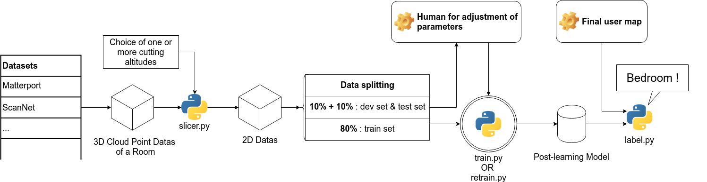

#room_classification_get_datasets
Project by [Paul Asquin](https://www.linkedin.com/in/paulasquin/) - Summer 2018 - paul.asquin@gmail.com  

# I.Introduction  
This repo is a part of the Room Classification Project. 
The aim of the Room Classification Project is to make an indoor mobile robot able to recognize a room using its 2D map. 
The output of the project should be "Kitchen", "Bedroom", "Batroom", etc.  

In order to achieve this goal, we have chosen to use Machine Learning techniques in order to obtain a powerfull recognition system with no hard-coded rules.  

As for every Machine Learning project, we need adapted datasets and a learning algorithm.  

Here is the overall architecture of the project :   
.  
├── room_classification_get_datasets  
├── room_classification_from_scratch_cnn  
├── room_classification_network_retrain  
├── Datasets (created by room_classification_get_datasets)  

  
_Room Classification Project Architecture_  

For a quick start, just run  

```
sudo python big_main.py
```
This script will run every step to download and process the datasets. Still, it can stop at many steps due to dependencies lacking.  
For a slower but safer run, follow the next instructions 

# II. Goals and instructions for room_classification_get_datasets  
  
## 0. Get the dependencies  
This project is using python3, tensorflow, opencv (cv2), PIL, plydata... So you may install them.
Maybe you'll find other forgoten dependencies. You will be able te easily install them. Do not hesitate to raise request to add their installation.
```
sudo apt-get install build-essential libssl-dev libffi-dev python-dev python3 python3-pip  
pip3 uninstall tensorflow --user  
pip3 install opencv-python tensorflow==1.3 Pillow plydata --user 
```

## 1. Download the datasets  
For this project, we are using datasets from [ScanNet](http://www.scan-net.org/) and [Matterport](https://matterport.com/).
In order to get them, we are using the scripts given by those organization [scannet_donwload.py](scannet_donwload.py) and [matterport_slicer.py](matterport_slicer.py).
We are also using specific command to class those datas. For the ScanNet dataset, we have developed [scannet_download_from_txts.py](scannet_download_from_txts.py).  
  
**WARNING** : In order to use those datasets, you need to obtain autorizations from ScanNet and Matterport teams.  
\- For Matterport : you will wind the instructions to accept the [END USER LICENSE AGREEMENT](http://dovahkiin.stanford.edu/matterport/public/MP_TOS.pdf) in the _Data_ of the [Matterport Github page](https://github.com/niessner/Matterport)  
\- For ScanNet : you will find the instructions to accept the [ScanNet Terms of Use](http://dovahkiin.stanford.edu/scannet-public/ScanNet_TOS.pdf) in the _ScanNet Data_ section of the [ScanNet Github page](https://github.com/ScanNet/ScanNet)  

### a. ScanNet  
[ScanNet](http://www.scan-net.org/) is a dataset developped by Stanford University, Princeton University and the Technical University of Munich. 
It is made with RGB-D scan of multiple rooms, reconstructed in [PLY files](https://en.wikipedia.org/wiki/PLY_(file_format)) (Polygon File Format). 
For each room of a unique type, we have a unique PLY file corresponding.  

In order to smart-download the ScanNet dataset, we have to get the room IDs we want to download. In order to do so :   
- Go to : https://dovahkiin.stanford.edu/scannet-browse/scans/scannet/querier  
- Display wanted scenes with the search bar (for example : enter "Kitchen")  
- Click on "Save Ids" (the drop-down menu should be on "original")  
- A window opens. Make a Ctrl+S  
- Rename the file as "room.txt" (example : kitchen.txt, bedroom.txt, living.txt...)  
- Save the .txt file in a folder "Scannet_IDs", at the project root  

The script [scannet_download_from_txts.py](scannet_download_from_txts.py) will read those txt files and use the script [scannet_donwload.py](scannet_donwload.py) to download only the PLY file of requested rooms. 
We can notice that their is not only one ply file per room ID (also call scene ID). Here, we are using \_2.ply files, that are at lower resolutions than regular .ply files.
Because we are going to reduce the resolution of our slices, this is acceptable and will improve our downloading and processing time.
The dataset will be written into the "Datasets/Scannet_PLY" folder and can use up to 220Go. With our script, each type of scene is split in a named folder corresponding to the name of txt files ("Kitchen", "Bathroom").

You may just run :
```
mkdir ../Datasets"  
python3 scannet_download_from_txts.py"
```

### b. Matterport  
The [Matterport](https://matterport.com/) dataset contains, like ScanNet, .ply files. However, those files are the result of a complete house scan. Auxiliary files with the .house extension give a label to the regions of the house. Thus, it is possible to cross the datas to extract specific rooms.

In order to download the Matrerport dataset, run : 
```
python3 matterport_download.py -o ../Datasets/HOUSE_SEGMENTATION --type house_segmentations
```

## 2. Process the datasets  
### a. Cut the rooms into slices
PLY files a 3D representation of rooms. Because we want to train an algorithm on 2D maps, as those created by regular mobile robot with LIDAR, we have to slice those datasets.
Furthermore, we will choose multiple slice altitudes. The altitudes and the heigth of the slices are given into the "dataset"\_slicer.py
Once the altitudes are chosen (or unchanged), you can run : 
```
sudo python3 scannet_slicer.py
sudo python3 matterport_slicer.py
```
The datasets will be written under the Datasets/JPG, splited between Bathroom, Kitchen, etc, folders. They will form a new and unique dataset.  

Here is an example of Matterport kitchen slices : 

Altitude 0.4m :  


Altitude 0.5m :  


Altitude 0.7m :  


### b. Clean and augment the dataset  
Sometimes, datas can have strange shapes. They can be bugs on multiple levels causing an unwanted image : almost empty maps, non-representative architectures, noises... 
You can remove those file by hand. But before that, you can use [image_processing.py](image_processing.py) techniques to speed up the process.  
  
You can use [image_processing.py](image_processing.py) in order to :  
\- **Remove blank-like images** with the argument _--blank_. The most common bug is almost no data in the extracted room. This bug mainly comes from the Matterport Dataset where rooms are not well bounded. 
Thus, resulting maps will be empty, or almost empty. To detect this bug, we check the size of the jpg image : if its size is under 3ko, the image is deleted. 
You may want to choose your own size value, especially if you are choosing to change the maps resolution.  
  
\- **Clean the dataset** with the argument _--clean_. We already have made some hand cleaning in our datasets. Then, we exported the name of the lefting rooms in the [clean_dataset.txt](clean_dataset.txt) file.
Using the _--clean_ argument, the programm will run --blank, then will remove every map extracted from rooms not indicated in [clean_dataset.txt](clean_dataset.txt).  
  
\- **Generate [clean_dataset.txt](clean_dataset.txt)** with the argument _--make_clean_dataset_. 
If you end up with a dataset well cleaned for your usage, you can run the _make\_clean\_dataset_ argument to generate your own [clean_dataset.txt](clean_dataset.txt).  
  
\- **Augment the dataset** with the argument _--augment_. You can generate map augmentations using this argument. Your dataset will end up with the 4 rotations of each maps and a vertical and horizontal mirror-flip of the original map. 
An augmentation allows the model to better extract new features or generalizations. Yet, the augmentation process may lead to [overfitting](https://en.wikipedia.org/wiki/Overfitting). 
To prevent this phenomenon, we will have to check our model training graphs. The _validation accuracy_ should never decrease.  

Be carefull, the order maters when you enter arguments calling [image_processing.py](image_processing.py). You want to clean the dataset before augmenting it.  
In order to one-shot this part, just run : 
```
sudo python3 image_processing.py --clean --augment
```  
  
If those steps saw a happy ending, you can move to either the _room_classification_from_scratch_cnn_ or _room_classification_network_retrain_ repo
